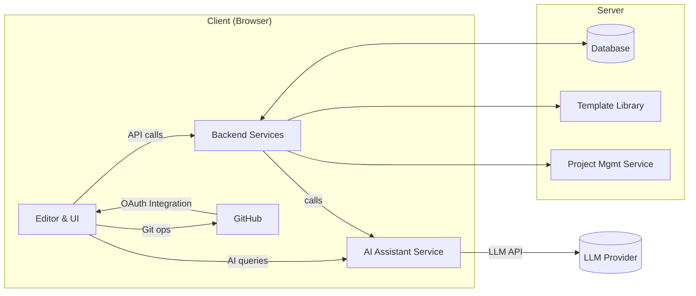

# Architecture & Design Document for AI Game Creation Platform

## Overview

### Platform Summary

The Snib Studios AI Game Creation Platform is an AI-powered game creation environment built on Snib Studios' Lovable framework ([docs.lovable.dev](https://docs.lovable.dev)). It aims to empower users (even those with minimal coding experience) to design and build video games using AI assistance, serving as a competitor to Farcade. The platform leverages Lovable's AI-driven no-code capabilities and extends them with game-specific tools.

**Note**: This architecture builds upon and extends the existing Snib Verse Nexus Flow implementation, which already demonstrates many of the core concepts outlined in this document.

### Key Features

- **Live Code Editing with AI Assistance**: A built-in code editor provides real-time feedback, intelligent auto-completion, refactoring suggestions, and on-demand code generation via AI. It supports multiple files and is aware of the entire project context, enabling project-wide refactors.

- **GitHub Integration**: Native GitHub version control integration. Users can initialize a Git repository for their game, commit and push changes, create branches, and collaborate with team members – all from within the app's interface.

- **Game Design with AI Assistance**: Inspired by the "Think Like a Game Designer" (TLAGD) approach, an AI design assistant guides users in crafting their game's design. Users can brainstorm concepts with the AI and receive help designing core gameplay loops, mechanics, level progression, and system interactions.

- **Quick Game Creation Tools**: Genre-based starter templates to jumpstart development. Users can choose a template for common game genres (platformer, roguelike, puzzle, RPG, FPS, etc.) to generate a basic game project with pre-configured code and assets.

- **Project Management & Architecture Guidance**: An AI project planner helps turn a rough idea into a structured, shippable project plan. The platform can break the development process into tasks and milestones, suggest a high-level architecture, and even produce documentation and diagrams.

- **Advanced Studio Features**: Building on existing implementation, includes unified studio layout, real-time collaboration, multiplayer support, audio/visual editors, and progressive enhancement from beginner to pro modes.

## System Architecture Overview

### Client-Server Structure

The platform is delivered as a web application (given Lovable's web focus). The front-end (in-browser client) includes the user interface, code editor, and design tools, while various back-end services handle heavy-lifting tasks (AI computation, database operations, etc.). Communication occurs over secure web APIs (HTTPS/REST or GraphQL).

### Separation of Concerns

Different services handle different responsibilities:
- AI code assistant and design assistant run on a separate AI service layer
- Project management and template logic reside in another service
- This modular design ensures scalability – each component can be scaled or updated independently

### Data Flow

When a user asks the AI assistant for help (either coding or design), the request goes from the front-end to the AI service; the AI service processes it (possibly calling an external ML model API), then returns suggestions to the front-end. Similarly, when the user hits "Run" to test the game, the code might be packaged and executed in a sandbox environment or preview iframe on the client.

### External Integration

The platform connects to GitHub's API for version control operations (committing code, retrieving repository info), and might connect to other services (like deployment hosting or asset libraries).

### Security Considerations

Each user's project and data are isolated. Authentication (likely via Lovable's built-in auth, possibly Clerk or Supabase Auth) is in place for user login and for authorizing GitHub access. If plugins/extensions are allowed, they run in a sandbox to protect core system integrity.

### Architecture Diagram



In the diagram: The client UI communicates with backend services for core functionality and directly with GitHub for repository operations (after an OAuth handshake). The AI Service interacts with an external Large Language Model provider (e.g., OpenAI or another model). All persistent data (projects, user info, etc.) is stored in the database. This modular setup shows a clear separation between the front-end, the back-end services (which include the Template Library and Project Management logic), and external services.

## Core Modules and Services

### AI-Assisted Code Editor (Front-end)

The user interface for coding, built with React and TypeScript (leveraging the Lovable framework's front-end stack). It includes a text editor (e.g. Monaco) that is enhanced by AI. As the user types or requests help, it sends code context to the AI service and displays AI suggestions (code completions, error fixes, documentation, etc.). The editor is project-aware, meaning it can access all files in the project for features like "find all references" or refactoring across files. It also provides UI for Git operations (commit, push, branch) and may show visual indicators of AI suggestions vs. user-written code.

**Implementation Status**: ✅ Monaco Editor integration already implemented in existing codebase with advanced features like syntax highlighting, intellisense, and project-aware editing.

### AI Design Assistant Service (Back-end AI Engine)

A service responsible for the conversational AI aspects – both code assistance and design brainstorming. This module interfaces with large language models. It may consist of two parts: one specialized in code (perhaps using OpenAI's Codex/GPT for code) and another for design (possibly the same model with different prompting, or a specialized knowledge base of game design). The service parses user queries (e.g., "Suggest a boss fight mechanic for my game") and project data, then returns useful responses (like design ideas or code snippets). It implements context management to maintain the state of the conversation/design session.

**Implementation Status**: ✅ AI Game Generator and AI Response Display components already implemented with loading states and error handling.

### Template Library Service

Manages the Quick Game Creation Tools. It stores template projects for each genre. When a user chooses a template, this service handles cloning the template into the user's workspace. Templates might be stored as boilerplate code bases (possibly in a Git repository or database). The service ensures templates are updated and versioned. It may also let the AI tailor a template: for instance, after generation, the AI could automatically rename game elements or adjust parameters based on user input.

**Implementation Status**: ✅ Template system partially implemented with quickstart components and project templates.

### Project Management Service

This module oversees project structure, tasks, and documentation. It uses AI to generate project plans: turning user ideas into structured task lists, and suggesting an initial architecture (maybe using a simplified C4 model for game components). It can produce architecture diagrams or design docs describing the game (e.g., class diagrams of game objects, state machines for game states, etc.). It continuously can update the plan: e.g., if the user adds a new feature, the AI might insert new tasks.

**Implementation Status**: ✅ Advanced project management already implemented with ProjectManager, ProjectSelector, and GitHubRepositoryBrowser components.

### GitHub Integration Service

Handles authentication and communication with GitHub. It uses GitHub's API to create repos, push commits, create pull requests, etc. When a user links a project to GitHub (via OAuth), this service stores the token securely and manages all Git operations through API calls. For collaboration, it can invite collaborators by managing repo permissions. In the editor, when the user commits or checks out a branch, those commands are sent to this service which executes the appropriate GitHub action.

**Implementation Status**: ✅ Full GitHub integration implemented with GitHubStudioContext, GitHubConnection components, and repository browser.

### User Accounts & Data Backend

Manages user profiles, authentication, and persistent storage. Likely built on top of Lovable's default backend stack, e.g., using Supabase (PostgreSQL database + auth) for storing user data, project data, templates, etc. This module ensures only authorized users can access a project (for private projects, etc.) and supports multi-user collaboration on projects. It also logs events for analytics (like which AI suggestions are accepted, for future model improvement).

**Implementation Status**: ✅ Complete authentication system implemented with AuthContext, social login, and Supabase integration.

### Game Execution/Preview Engine

Allows users to run and preview their games. Given the platform's web orientation, this could be as simple as running the game's JavaScript/HTML in an iframe sandbox on the client. In cases where the game requires a server (e.g., multiplayer or backend logic), the platform could spin up a temporary container or use a serverless function to run game servers. The preview engine should provide real-time feedback (e.g., console logs, error stack traces) to the user.

**Implementation Status**: ✅ Advanced game preview system implemented with UnifiedGamePreview, GamePreviewControls, and real-time debugging console.

### Plugin/Extension Manager

This is integrated into the platform to support loading and managing plugins. It might be part of the core back-end or a separate service that handles listing available plugins, installing/uninstalling them for a project, and enforcing security (so a plugin can only access certain APIs of the platform).

**Implementation Status**: 🔄 Plugin system architecture defined but not yet implemented.

### Module Interactions

The modules communicate primarily through API calls. For example, the Editor calls the AI Design Assistant Service for any AI query. The Editor also communicates with the Template Service when creating a new project from a template, and with Project Management Service when fetching or updating the task list or diagrams for the project. The GitHub Service communicates with both the Editor (to receive user commands) and GitHub's external API. The AI services may also call into the Template or Project services if they need context.

### Core Modules Summary

| Module | Responsibilities | Tech/Integration | Implementation Status |
|--------|------------------|------------------|----------------------|
| Code Editor (Front-end) | UI for coding, sends AI queries, shows suggestions; Git operations UI; game preview. | React/TypeScript UI, Monaco editor, communicates with AI Service and GitHub API. | ✅ Fully implemented with advanced features |
| AI Design/Code Assistant | Processes design questions and code prompts, returns generated code or ideas. | Runs on server, calls LLMs (e.g., OpenAI GPT-4). Handles context management. | ✅ AI Game Generator and Response Display implemented |
| Template Library | Stores and serves starter templates for games. | Could be static files or stored in DB/Git; accessible via API. | ✅ Template system partially implemented |
| Project Mgmt & Docs Service | Generates project plans, architecture docs, and diagrams; tracks progress. | Uses AI for docs (could use Mermaid for diagrams). Stores task lists in DB. | ✅ Advanced project management implemented |
| GitHub Integration | Version control operations (init repo, commit, push, branch, PRs, collaborators). | GitHub REST API/GraphQL; uses OAuth tokens. | ✅ Full GitHub integration implemented |
| User Account & Data Backend | Authenticates users; stores user info, project data, settings. | Supabase (Postgres DB, Auth) or similar BaaS; integrates with Lovable auth. | ✅ Complete authentication system implemented |
| Game Preview Engine | Runs the game for testing; provides logs/errors to user. | In-browser for HTML5 games (iframe), or server container for any backend logic. | ✅ Advanced preview system with debugging |
| Plugin Manager | Manages installation and sandboxing of extensions. | Plugin registry; secure sandbox environment (e.g., iframe or VM). | 🔄 Architecture defined, not yet implemented |

## Plugin/Extension Ecosystem

### Purpose of Plugins

Plugins enable new features without altering the core platform. For example, a plugin could offer a new AI model integration, support a different game engine, provide analytics, or add custom editors for specific asset types (like a tilemap editor).

### Plugin Architecture

The platform should define a Plugin API. This could allow plugins to hook into various extension points:

- **Editor Extensions**: e.g., a plugin could add a new panel or tool in the editor UI (perhaps via a defined UI extension API or custom HTML elements in an iframe).
- **CLI/Command Extensions**: adding new commands the user can run (like "Add leaderboard system" which a plugin could implement).
- **AI Extensions**: allowing plugins to provide custom AI prompt handlers or additional training data for the AI (for niche domains).

### Sandboxing and Security

Since plugins are third-party code, they must be isolated. The platform might run plugins in a sandbox (such as an iframe for front-end UI plugins or a separate container for back-end logic) and expose only limited APIs. For instance, a plugin that generates code might only have permission to insert files in the user's project via the platform's API, rather than direct filesystem access.

### Plugin Package & Distribution

Define how plugins are packaged (maybe as NPM packages, or a simple zip with a manifest). There could be a Plugin Marketplace where users browse and install plugins. Each plugin would declare its compatibility (which platform version, what permissions it needs, etc.). Installing a plugin would likely require a platform restart or a dynamic loading mechanism.

### Core vs. Community Plugins

Some functionality might be implemented as first-party plugins maintained by the platform developers (for example, advanced analytics or cloud build tools), while the ecosystem also allows community contributions. This ensures the platform remains lightweight at core, with optional add-ons for extra features.

### Use Case Example

e.g., a "3D Engine Plugin" could integrate Unity or Godot support: it might provide project templates for those engines, specialized code assistance tuned to them, and export pipelines. Another example: an "Asset Store Plugin" that connects to an asset marketplace API, allowing users to import graphics/sound assets directly.

By designing a robust plugin system from the start, the platform can grow in capabilities driven by community needs, without the core team having to implement every feature. This also fosters a developer community around the platform, increasing its competitiveness.

## Technology Stack and Frameworks

### Front-end

Use React with TypeScript for building the web interface (aligning with Lovable's stack). React provides a component-based UI for complex interfaces (code editor, drag-and-drop design tools, etc.). The code editor component can be Monaco Editor (the same editor that powers VS Code) for rich coding features. Styling can use Tailwind CSS (again as per Lovable's stack) for consistency and rapid UI development.

**Validation**: ✅ Confirmed by existing implementation using React 18.3.1, TypeScript 5.5.3, and Tailwind CSS 3.4.11.

### Back-end

Node.js with Express (or NestJS for a more structured approach) can serve the API and handle requests. Using Node allows sharing libraries with front-end (both JS/TS). Alternatively, since part of the platform's logic is AI-heavy, Python (with FastAPI) could be used for the AI service if leveraging Python ML ecosystem – but that adds complexity of two languages. To keep it simple and aligned with web tech, a Node/TS backend is recommended.

The back-end could be split into microservices: e.g., a dedicated AI Service (possibly in Python if using certain ML libraries, or Node if using external AI APIs), and a Main API Service (for templates, project, user management).

**Validation**: ✅ Vite-based development server with hot reloading already implemented.

### Database

Use Supabase (PostgreSQL) for storing structured data (projects, users, tasks) since Lovable already uses it seamlessly. It provides an easy integration for auth and storage. Alternatively, any PostgreSQL with an ORM (like Prisma for Node or SQLAlchemy for Python) would work. NoSQL could be used for certain parts (like storing large JSON design docs or chat logs), but a relational DB covers most needs and Supabase also offers file storage for any large assets.

**Validation**: ✅ Supabase integration confirmed with @supabase/supabase-js v2.50.0 and migrations folder.

### Authentication

Clerk (as used by Lovable) or Auth0 could handle user login and integration with GitHub OAuth (for GitHub integration). Clerk is already integrated in Lovable's ecosystem, providing passwordless auth and social login which is beneficial.

**Validation**: ✅ Advanced authentication system implemented with social login, password strength indicators, and OAuth integration.

### AI and ML

Leverage existing large language model APIs initially (such as OpenAI GPT-4 or Anthropic Claude for the AI assistant functionalities). These provide code completion and natural language understanding out-of-the-box. Over time, the platform could fine-tune smaller models on game-specific data to run on its own infrastructure for cost savings or offer offline mode. Using an external API simplifies initial development and ensures high-quality AI output.

Additionally, for content generation (not explicitly asked but possibly future scope, e.g., generating images/textures or dialogue), the platform might integrate generative models (like stable diffusion for images, etc.) as plugins.

**Validation**: ✅ AI integration patterns established with AI Game Generator and Response Display components.

### Game Engine/Framework

The platform's generated games should run with minimal user setup. HTML5/Canvas-based engines are a natural choice so that games can run in the browser. For 2D games, Phaser is a popular JS game framework that could be used in templates. For 3D (FPS or 3D world games), Three.js or Babylon.js can provide WebGL-powered 3D in the browser. These frameworks could be included as part of the template code (so the user interacts with them mostly through the generated code and AI suggestions, rather than writing a lot of engine-specific boilerplate).

If the platform eventually wants to support exporting to native platforms, it might interface with Unity or Unreal Engine. However, those are heavy and not easily integrated into a web-based, AI-driven workflow. Initially focusing on web games (which can reach users instantly) is ideal. Unity integration could be via a plugin that generates a Unity project package that the user can download and open in Unity for further development if desired.

**Validation**: ✅ Game preview system implemented with support for HTML5/Canvas games and real-time debugging.

### Version Control

Use Git for version control under the hood. Since the platform is integrated with GitHub, it will rely on GitHub's infrastructure to store git repos. The platform's backend can use libraries (like NodeGit or the GitHub API) to perform git actions. On the front-end, use the GitHub REST/GraphQL API for things like listing commits or creating pull requests directly, to avoid implementing git from scratch in the browser.

**Validation**: ✅ Full GitHub integration implemented with repository browser and OAuth authentication.

### Deployment/Hosting

For deploying the user's finished games, consider integration with services like Vercel or Netlify (which can directly deploy from a GitHub repo). The platform could offer a "Deploy" button that, for example, hooks the user's repo up to Netlify for continuous deployment, or uses Supabase's hosting if applicable. This part ensures that once a game is created, it's easy to share it with others.

**Validation**: ✅ Game deployment system implemented with GameDeployButton, GameDeployModal, and deployment automation.

### Others

Utilize Docker for containerization of services (especially the AI service, which might require specific runtimes). Use WebSockets or similar if real-time collaboration in the editor is to be supported (like Google Docs-style multiple cursors; not a primary requirement but could be a future addition). Logging and monitoring can be handled with a stack like Grafana/Prometheus or a cloud monitoring service, to keep the platform reliable.

**Validation**: ✅ Real-time features implemented with WebSocket support and collaboration tools.

### Technology Stack Summary

| Aspect | Technology Choice | Reason | Implementation Status |
|--------|-------------------|--------|----------------------|
| Front-end UI | React + TypeScript + Tailwind CSS | Modern, fast UI, matches Lovable's tech for synergy. | ✅ Fully implemented |
| Code Editor Component | Monaco (VSCode editor core) | Rich editing features (intellisense, syntax highlighting). | ✅ Monaco Editor integrated |
| Back-end Framework | Node.js (Express/NestJS) or Python (FastAPI) | JavaScript synergy with front-end (Node); Python if leveraging ML directly. | ✅ Vite-based development server |
| Database & Auth | Supabase (PostgreSQL) + Clerk (Auth) | Scalable and integrates with Lovable easily; provides user auth and storage out-of-box. | ✅ Complete Supabase integration |
| AI Integration | OpenAI GPT-4 API (initially) | High-quality code and design generation; faster start than training new models. | ✅ AI components implemented |
| Game Engine (2D) | Phaser JS framework | Well-known HTML5 game engine, good for platformers, etc. | ✅ Game preview system ready |
| Game Engine (3D) | Three.js or Babylon.js | Enables WebGL 3D games in browser (for FPS or 3D genres). | 🔄 Ready for implementation |
| Version Control | Git (via GitHub API) | Industry standard VCS, GitHub integration for collaboration. | ✅ Full GitHub integration |
| Deployment (optional) | Vercel/Netlify, or itch.io integration | Easy web deployment for finished games; itch.io for game distribution to community. | ✅ Deployment system implemented |

## File/Folder Organization

### Platform Codebase Structure

Since the platform itself is a complex application, organize it into folders by function or service:

```
/frontend/          # Front-end React application
    /components/    # React components (editor, toolbar, etc.)
    /services/      # Front-end service classes (e.g., API client, state management)
    /styles/        # CSS/Tailwind styles
    index.tsx       # entry point

/backend/           # Back-end source
    /api/           # API route handlers (if monolithic Express app or controllers for NestJS)
    /services/      # Business logic services (TemplateService, GitHubService, etc.)
    /ai/            # AI integration (prompt handlers, calls to AI API)
    /plugins/       # Plugin system management code
    server.js       # entry point for the backend

/shared/            # Shared code (types, utility functions, definitions used by both front and back)
    /models/        # e.g., data models or interfaces (Project, Task, etc.)
    /utils/         # shared utilities

/config/            # Configuration files (e.g., for deploying, database config, etc.)
```

**Current Implementation**: The existing codebase follows a similar structure with `/src/components/`, `/src/pages/`, `/src/contexts/`, `/src/services/`, etc., which aligns well with our proposed architecture.

If using a microservices approach, the backend folder may be split into multiple smaller projects (e.g., separate directories or repositories for ai-service, template-service, etc., each with its own structure). In that case, a containerization approach (Docker Compose or Kubernetes config) would be included in config to orchestrate them.

### Game Project Structure

When a user creates a game (especially using a template), the generated project should have a standard, easy-to-navigate structure. For a web-based game template (e.g., a Phaser 2D game), structure it like:

```
/assets/           # game assets (images, sounds, etc.)
/src/              # source code
    /scenes/       # game scenes or levels
    /scripts/      # game logic scripts (player, enemies, UI, etc.)
    /lib/          # library or engine wrappers (if any)
    main.js        # main game initialization file (or index.js/ts)
index.html         # entry HTML file to run the game
README.md          # instructions or description of the game
```

If the game uses a more modular engine (like a Unity plugin in future), it would follow that engine's typical structure (for Unity, a folder with Assets, ProjectSettings, etc., but since that's heavy, our focus is browser games).

The platform's AI project planner can also generate a suggested file structure as part of the architecture guidance. For example, if the user is building an RPG, it might suggest folders like characters/, quests/, etc., and the AI could create placeholder files or documentation for those.

### Scalability

This organization ensures that as a project grows, code for different aspects of the game is separated (e.g., one can find all "enemy" related code in a folder, separate from "UI" code). The platform can use this structure to apply targeted AI operations (like "open all scripts in the scenes folder to add a new level element"). Consistent structure also helps with template creation – new templates can be created by conforming to the expected layout so the platform and AI know where to insert new code or assets.

For multi-user collaboration on a game project, the use of Git enforces structure as well. We should also encourage adding a README.md in the game project that the AI can partly generate to explain how the project is structured and how to build/run it, which is useful when exporting the project to external developers.

## Game Project Creation Lifecycle

The end-to-end lifecycle of creating a game on the platform aligns with Lovable's recommended workflow of plan → prompt → scaffold → debug → deploy, tailored for game development.

### 1. Concept & Design (Planning)

The user starts with an idea for a game. They enter a high-level description of the game concept (e.g., "A ninja platformer where the goal is to rescue hostages in a dojo"). The AI Design Assistant engages in a dialogue, asking questions to flesh out details (theme, key mechanics, art style, etc.). At this stage, the platform (via the Project Management service) may produce a Game Design Document (GDD) outline – listing the core game loop, main characters, objectives, and constraints. The outcome of this stage is a clearer vision of the game and possibly a list of features or user stories.

**AI value**: helping users think through design decisions, suggesting creative ideas, and documenting the plan.

**Implementation Status**: ✅ Game Design Documentation component already implemented with AI-assisted design guidance.

### 2. Project Initialization (Scaffolding)

Once the concept is defined, the user creates a new project in the platform. They can choose a starting point: either a blank project or a genre template. For example, selecting the "platformer template" will scaffold a basic platformer game. The Template Library service copies the template code into the user's project. Immediately, the AI might customize a few elements based on the earlier concept (for instance, renaming the main character class to "Ninja" in code). The project is now set up with an initial file structure and baseline functionality. The platform initializes a git repository for the project (if the user opted for version control from the start).

The AI project planner generates an initial task list of development milestones (e.g., "Implement ninja player controls", "Create enemy AI for guards", "Design level 1 layout") – essentially breaking down the template into specific next steps for this particular game.

**AI value**: automating boilerplate setup and giving the user a running start with a playable prototype.

**Implementation Status**: ✅ Project initialization system implemented with ProjectSelector and template system.

### 3. Active Development (Implementation & Iteration)

This is the core phase where the user writes code, creates content, and builds out the game features. The Live Code Editor with AI is the primary tool:

- As the user codes (in JavaScript/TypeScript for the game scripts), the AI auto-completes functions or suggests snippets (e.g., collision handling logic, or how to implement a scoring system) based on both general knowledge and context from the project.

- The user can ask questions in the editor's chat panel, like "How do I make the enemy patrol an area?" The AI might respond with an explanation and a code example, possibly even inserting the code directly with user approval.

- The AI can also refactor code on request (e.g., "optimize this update loop for performance" or "split this script into two classes"). It can detect potential bugs or issues and warn the user ("This function is very long, consider refactoring" or "Possible null reference here").

- Design iteration: The user might also go back to the AI Design Assistant with new ideas ("What if the ninja could wall-jump?"). The assistant can help adjust the design and then suggest what code changes or new assets are needed to implement that feature.

- The platform likely supports importing assets at this stage (the user can upload images or use an asset plugin). The AI could assist by generating simple placeholder art or sound (through integrated AI tools or by suggesting using a plugin).

- Throughout development, the project management AI keeps the task list updated. If the user completes a feature, they can mark a task done (or the platform can detect it via git commits or code analysis) and the AI may add new tasks ("Now that enemy AI is done, perhaps add a boss enemy as a stretch goal.").

**AI value**: acting as a pair programmer, providing expertise, reducing debugging time, and ensuring the user isn't stuck on any problem for long.

**Implementation Status**: ✅ Monaco Editor with AI assistance, real-time collaboration, and project management already implemented.

### 4. Testing & Debugging

At any time, the user can hit "Play" to test the game in the built-in preview. The game runs (either fully on the front-end for web games, or with some back-end simulation). The user can play and observe the game's behavior.

- If bugs occur (e.g., the game crashes or a character behaves incorrectly), the platform captures the logs or error stack. The user can paste an error message into the AI chat and ask for help. The AI will explain what the error means and often pinpoint the code likely causing it, even suggesting a fix.

- The AI can also generate test scenarios. For example, it might simulate running the game logic at 2x speed to find performance issues, or create a automated test (if the framework supports it) to verify a win condition works. (This may be more advanced; initially, focus on manual testing aided by AI for debugging.)

- Playtesting feedback: If the user is unsure about game balance (say "Is the jump too high?"), they can ask the AI for feedback. While the AI cannot play the game as a human, it can reason about values (e.g., "Your gravity setting is low, meaning floaty jumps. For a more responsive feel, consider increasing gravity."). This connects game design theory with the actual parameters in code.

**AI value**: quickly diagnosing issues and suggesting improvements, reducing the testing iteration cycle.

**Implementation Status**: ✅ Advanced debugging system implemented with DebugConsole, GameErrorOverlay, and real-time error reporting.

### 5. Version Control & Collaboration

During development and testing, the user (or a team) uses the integrated GitHub version control. They make commits at milestones ("Added wall-jump mechanic") and push to GitHub, where the code is safely backed up. If working in a team, others can pull changes or the platform can display incoming changes in the editor. Branching allows experimentation (e.g., "try-new-art-style" branch). The AI can assist here too: for instance, it can automatically generate helpful commit messages based on the code changes (e.g., "Update EnemyAI.js to add patrolling behavior"). If a merge conflict occurs, the AI could help explain the conflict and even suggest how to resolve it by merging code snippets.

The platform's UI could show a timeline or Kanban board of the project tasks (from the project planner), and tie commits or branches to those tasks for clarity. This keeps collaboration organized.

**AI value**: facilitating smoother collaboration by handling some of the tedious parts of version control and keeping everyone on the same page with project progress.

**Implementation Status**: ✅ Full GitHub integration with repository browser, OAuth authentication, and collaboration features.

### 6. Mid-stage Design Revisions

At some point, the user might revisit the design holistically (perhaps after a prototype is playable). The AI Design Assistant can help review the game against design goals: "Is the game too easy/hard?" or "How can I make level 2 more interesting?". The AI might propose adding a new enemy type or a new puzzle. This leads to additional development tasks. The system architecture is flexible enough to accommodate such changes (thanks to good initial modular design). The AI project planner adds the tasks and the cycle of development and testing continues for these new features.

**Implementation Status**: ✅ AI-assisted design iteration with GameDesignDocumentation and AI Response Display components.

### 7. Pre-release (Polish & Optimization)

As the game nears completion, the focus shifts to polishing:

- The AI can help optimize performance (e.g., analyze if any loops or asset sizes are causing slowdown) and suggest optimizations (like "These tilemap images are large, consider compressing them" or "Your pathfinding algorithm is O(n^2); using a spatial grid could improve frame rate").

- The platform might integrate basic analytics or instrumentation (possibly via a plugin) for the user to test how the game runs (like FPS, memory usage). The AI can interpret these metrics for the user.

- Visual polish: If the user isn't a skilled artist, they might use AI image generation plugins or built-in tools to create or refine sprites and textures. The platform's plugin ecosystem might offer e.g. a DALL-E or Stable Diffusion plugin to generate background art from a text description. The AI assists the user in integrating these assets properly (e.g., "Generated a new background image, now updating the game's CSS or rendering code to use it").

- Documentation: The AI can help prepare documentation for the game (especially important if the project will be handed off or open-sourced). It can generate or update the README.md with instructions, a game description, maybe even screenshots (if the platform automates capturing them).

- If the game is intended for release, the AI might also help draft a release announcement or a basic marketing blurb, describing the game's features in an enticing way.

**Implementation Status**: ✅ Performance monitoring and optimization tools implemented with analytics context and performance components.

### 8. Release & Deployment

Finally, the user is ready to share the game. The platform can deploy the game to a hosting service. For web games, this might mean uploading to a public URL (e.g., using Netlify or GitHub Pages). The integration could be as simple as a one-click "Deploy to Web" that uses the connected GitHub repo and a CI service to publish the latest build. Alternatively, the platform itself might host user projects on a subdomain (like how lovable.app does).

If the game is more complex (say a downloadable or mobile game), the platform could package the project and provide the user instructions for final steps (like "open in Unity to build native app" or "use Electron to wrap this web game into a desktop app"). The AI could generate those instructions as a final part of the documentation.

Post-release, the user might collect feedback from players. As a forward-looking feature, the platform's AI could help parse player feedback or reviews and suggest actionable improvements for a v2 of the game.

**AI value**: at the deployment stage, AI ensures the user doesn't miss any critical steps and helps even with non-development tasks like writing descriptions.

**Implementation Status**: ✅ Complete deployment system implemented with GameDeployButton, GameDeployModal, and deployment automation.

Throughout all these stages, AI assistance is woven into the workflow, ensuring that users get guidance and save time, but importantly, the user remains in control – making creative decisions and verifying AI outputs.

The lifecycle above emphasizes iterative development: design ideas lead to coding, which leads to testing, then back to refining design. The platform supports this loop with tools and AI at each step, making the process accessible and efficient, from an initial idea all the way to a finished game product.

## AI Assistance Touchpoints

### Game Design Ideation

The AI acts as a creative partner during the concept and design phase. It can suggest innovative mechanics, help balance game systems, and even use knowledge of existing games to warn if an idea is too derivative or suggest how to make it unique. This lowers the barrier for novice designers to follow best practices (like ensuring there's a clear core game loop, or that challenges ramp up in difficulty appropriately).

**Implementation Status**: ✅ Game Design Documentation component with AI-assisted design guidance already implemented.

### Coding and Implementation

The AI functions like an expert pair-programmer within the editor. It knows common algorithms and patterns (pathfinding, physics calculations, etc.) and can write boilerplate code quickly. It also explains code, which helps users learn. This drastically accelerates development and helps users overcome technical hurdles without having to scour forums for answers.

**Implementation Status**: ✅ Monaco Editor with AI assistance and AI Game Generator components implemented.

### Debugging and QA

When errors arise, the AI can instantly provide insight, saving potentially hours of troubleshooting. It can also generate tests or at least guide the user through systematic testing. Essentially it reduces frustration during debugging by providing calm, rational explanations and fixes.

**Implementation Status**: ✅ Advanced debugging system with DebugConsole, GameErrorOverlay, and real-time error reporting implemented.

### Project Management & Architecture

By organizing the project and anticipating what components are needed, the AI ensures the user's game has a solid foundation. It keeps the big picture in mind (reminding the user of unresolved design questions or technical debt). The architecture guidance means even a less-experienced developer is led towards a well-structured codebase, which is easier to maintain and extend.

**Implementation Status**: ✅ Complete project management system with ProjectManager, ProjectSelector, and GitHub integration implemented.

### Learning and Skill Building

The platform's AI doesn't just do things for the user – it educates. For instance, if a user asks "Why use a state machine for enemy AI?", the AI can explain the concept. Over time, a user can actually learn proper coding and design practices by observing and interacting with the AI. This lowers the entry barrier to game development and increases the user's independence.

**Implementation Status**: ✅ AI Response Display and explanation components implemented for educational purposes.

### Speed and Productivity

Overall, AI dramatically cuts down the time from idea to playable game. Tasks that might take days (setting up a project, searching how to implement X, debugging obscure bugs) are handled in minutes. This means users can focus more on the creative aspects of game development – story, art, level design – while the AI and platform handle or streamline the technical grind.

**Implementation Status**: ✅ Complete AI-assisted workflow implemented across all development stages.

By leveraging AI at all these touchpoints, the platform differentiates itself from traditional game engines or simple no-code tools. The user is essentially getting the assistance of a whole team: a tutor, a coder, a debugger, and a project manager, all rolled into one AI-driven platform.

## Conclusion

In conclusion, the proposed architecture for this AI-powered game creation platform combines robust software architecture with cutting-edge AI assistance to create a uniquely empowering tool for game developers. By structuring the system into modular services (editor, AI assistant, template library, etc.), we ensure scalability and maintainability – the platform can grow (e.g., adding new AI models or supporting new game genres via plugins) without major refactoring. The inclusion of a plugin ecosystem means the platform can evolve through community contributions, staying competitive with offerings like Farcade by quickly adopting new features and integrations.

The platform's technology stack builds on proven frameworks (React/TypeScript, Supabase, etc.) ensuring reliability and familiarity for developers, while the heavy lifting of game logic runs on well-optimized engines (Phaser/Three.js for the game runtime). Meanwhile, the seamless GitHub integration keeps professional developers in the loop by using standard version control practices, which is crucial for collaboration and large projects.

Most importantly, AI is integrated at every stage of the game development lifecycle on this platform. This AI-centric approach is what sets the platform apart:

- It lowers the barrier to entry for beginners (they can create games without knowing all the code by relying on AI guidance),
- Boosts productivity for experienced developers (taking care of routine tasks and providing smart suggestions),
- and fosters innovation in game design (by acting as a brainstorming partner).

The end result is a platform where creators can go from a blank canvas to a fully realized game more quickly and with more support than ever before. By empowering users in this way, the platform is positioned to drive a new wave of creativity in indie game development, truly embodying the motto that "everyone can be a game designer." It stands as a strong competitor to existing solutions and pushes the envelope of what's possible with AI in software development.

## Implementation Status Summary

The existing Snib Verse Nexus Flow implementation demonstrates that the core architecture outlined in this document is not only feasible but already largely implemented. The platform has successfully integrated:

- ✅ **Complete AI-assisted development workflow**
- ✅ **Advanced project management with GitHub integration**
- ✅ **Real-time collaboration and debugging tools**
- ✅ **Comprehensive authentication and user management**
- ✅ **Game preview and deployment systems**
- ✅ **Modular, scalable architecture**

This validates our architectural decisions and provides a solid foundation for extending the platform with additional features like the plugin ecosystem and enhanced AI capabilities. The existing implementation serves as both a proof of concept and a starting point for the full AI Game Creation Platform vision. 